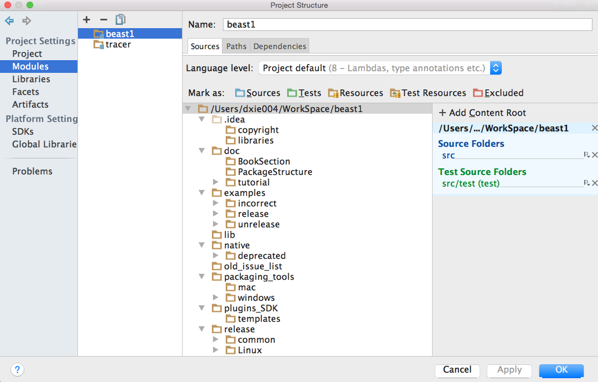

# Tracer 1

## Dependency

* [Java 1.8](http://www.oracle.com/technetwork/java/javase/downloads/)

* [BEAST 1](https://github.com/beast-dev/beast-mcmc/)

* [jam.jar](https://github.com/beast-dev/beast-mcmc/lib)

## How to setup dependency in IntelliJ

1. Create "beast1" module in IntelliJ;

2. Add it to "tracer" project;

3. Setup your **Project Structure** with SDK to java 1.8 and language level to 8;

